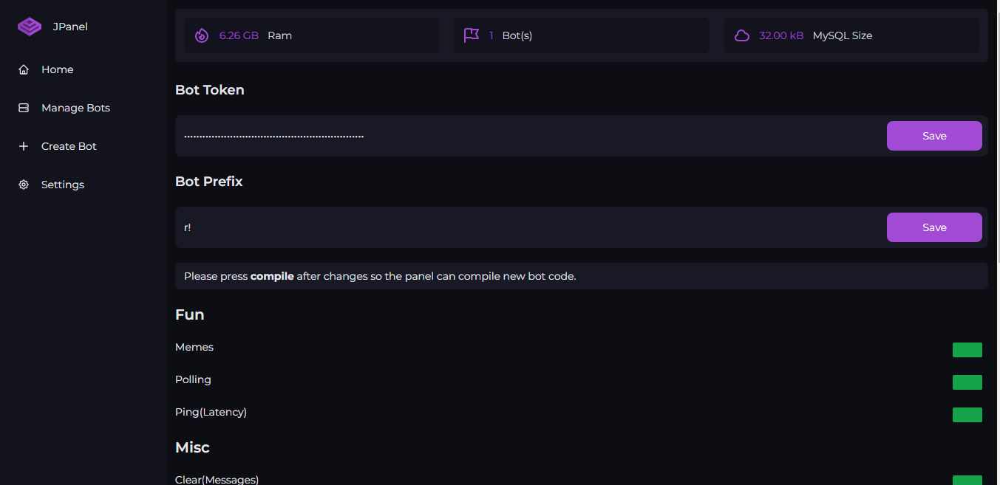
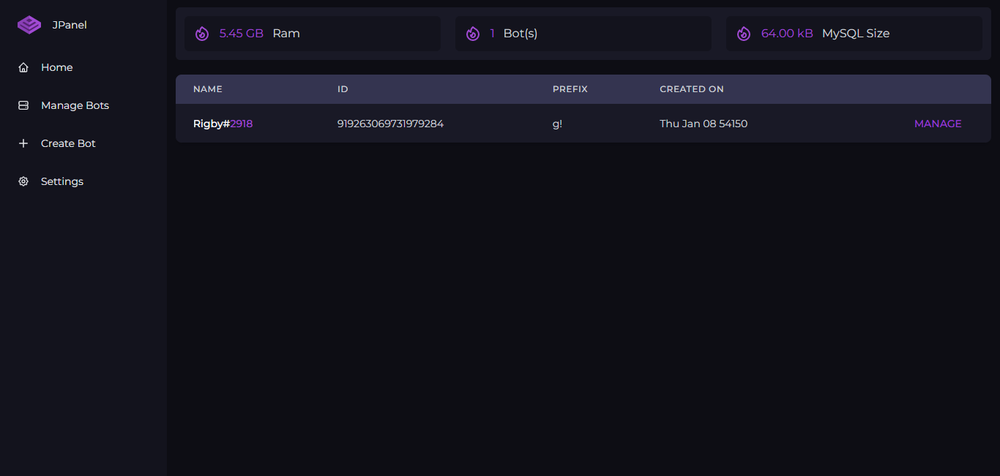

# Bot-o-Maker

A good panel to create & host a discord bot without need of code, simple configs.

## Requirements

✔️ MySQL<br>
✔️ Node.js

## Installation

```shell
## Install Modules (required)
cd ./path/to/the/folder/with/jpanel/files
npm install
## Install PM2 Globaly (optional)
npm install pm2 -g
## Start panel
node .
```

## Configs

Edit the `.env` and fill in the required files.

## Preview



